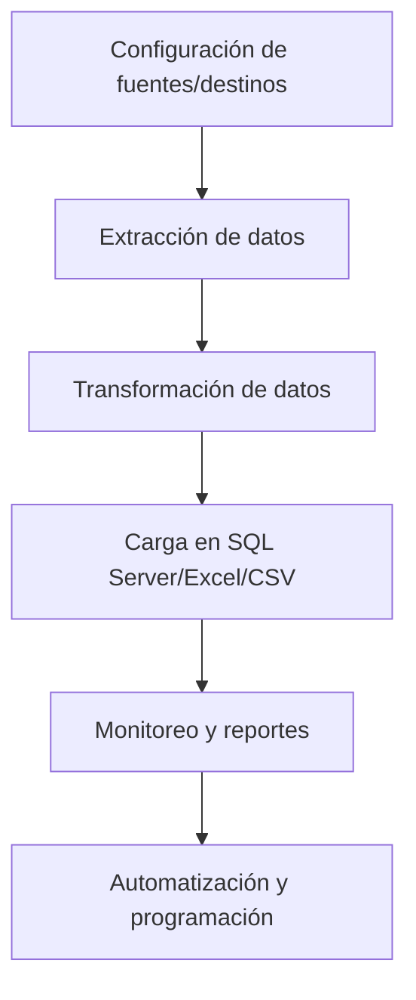

### 2025-09-03 - Avance en la interfaz de usuario (dashboard)

- Se corrigió la estructura de la clase principal de la interfaz para evitar errores de ejecución.
- Se agregó un panel de notificaciones/logs recientes en la parte inferior del dashboard, permitiendo visualizar mensajes de estado, advertencias y errores recientes de los procesos ETL.
- El panel de logs utiliza un `QListWidget` para mostrar mensajes simulados, que luego se conectarán a los logs reales del sistema.
- Se mantiene la documentación y registro de cada avance y decisión en el archivo `DOCUMENTACION_DESARROLLO.md`.
# Documentación del Proyecto ETL_EMPRESA

## 1. Descripción General

Este proyecto tiene como objetivo implementar un sistema ETL (Extract, Transform, Load) profesional y escalable para la empresa, permitiendo la integración de datos desde múltiples fuentes (APIs, bases de datos, archivos, etc.), su transformación según reglas de negocio y su carga en un Data Warehouse (SQL Server) y archivos Excel/CSV para análisis y reportes.

---

## 2. Arquitectura General

### Módulos Principales
- **Extracción:** Obtención de datos desde APIs (ej. Zoho Bigin), bases de datos, archivos Excel/CSV, etc.
- **Transformación:** Limpieza, normalización y aplicación de reglas de negocio sobre los datos extraídos.
- **Carga:** Inserción de datos procesados en SQL Server, archivos Excel/CSV y otros destinos.
- **Orquestación:** Programación y control de los flujos ETL, gestión de errores y notificaciones.
- **Interfaz de usuario:** Dashboard visual e intuitivo para monitoreo, configuración y reportes (Streamlit).

### Flujo Básico
1. Configuración de fuentes y destinos.
2. Ejecución de procesos ETL (manual o programada).
3. Registro de logs y manejo de errores.
4. Visualización de resultados y estado de los procesos.

---

## 3. Herramientas y Tecnologías

- **Lenguaje:** Python
- **Frameworks/Librerías:**
  - Extracción: `requests`, `pandas`, `pyodbc`, `openpyxl`
  - Transformación: `pandas`
  - Carga: `pyodbc`, `pandas.to_sql`, `openpyxl`
  - Orquestación: `Apache Airflow` (opcional), `Task Scheduler` (Windows)
  - Interfaz: `PyQt5` (aplicación de escritorio profesional)
- **Base de datos destino:** Microsoft SQL Server
- **Control de versiones:** GitHub
- **Documentación:** README, manual de usuario
- **Pruebas:** Unitarias con `pytest`
- **Logs:** Registro de ejecución y errores
- **Configuración:** Archivos `.env` o `config.py`

---

## 4. Estructura de Carpetas Sugerida

```plaintext
ETL_EMPRESA/
│
├── etl/
│   ├── sources/           # Módulos para cada fuente de datos
│   │   ├── zoho_bigin.py
│   │   ├── sql_server.py
│   │   ├── excel.py
│   │   └── ...            # Otros conectores
│   ├── transforms/        # Módulos de transformación
│   │   ├── normalize.py
│   │   ├── clean.py
│   │   └── ...
│   ├── destinations/      # Módulos para destinos
│   │   ├── sql_server.py
│   │   ├── excel.py
│   │   └── ...
│   ├── orchestrator.py    # Orquestación de procesos ETL
│   ├── config.py
│   └── utils.py
│
├── interface/
│   ├── main_window.py     # Ventana principal PyQt5
│   ├── views/             # Subvistas PyQt5
│   │   ├── source_view.py
│   │   ├── ocr_view.py    # Vista para extracción OCR
│   │   ├── transform_view.py
│   │   ├── destination_view.py
│   │   └── log_view.py
│   └── components/        # Componentes reutilizables PyQt5
│       ├── sidebar.py
│       ├── table.py
│       └── ...
│
├── data/
│   └── ...                # Archivos fuente y resultados
│
├── logs/
│   └── ...                # Logs de ejecución
│
├── tests/
│   └── ...                # Pruebas unitarias
│
├── requirements.txt       # Dependencias Python
│
└── README.md              # Documentación
```

---

## 5. Proceso ETL

1. **Configuración:** El usuario selecciona fuentes y destinos desde la interfaz.
2. **Extracción:** El sistema obtiene datos desde APIs, bases de datos y archivos.
3. **Transformación:** Se limpian y normalizan los datos según reglas de negocio.
4. **Carga:** Los datos se insertan en SQL Server y/o se exportan a Excel/CSV.
5. **Monitoreo:** El usuario visualiza el estado, logs y resultados desde el dashboard.
6. **Automatización:** Los procesos pueden programarse para ejecución automática.

---

## 6. Ejemplo de Flujo Gráfico



---

## 7. Consideraciones Especiales

- **Data Lake:** Se puede agregar si el volumen de datos crece o se manejan datos no estructurados.
- **APIs externas:** Ejemplo Zoho Bigin, integración para extraer tratos, empresas, contactos y archivos.
- **Exportación de archivos:** Se recomienda Excel (`.xlsx`) para usuarios no técnicos, y CSV para interoperabilidad.
- **Seguridad:** Protección de credenciales y datos sensibles.
- **Escalabilidad:** Modularidad para agregar nuevas fuentes/destinos fácilmente.

---

## 8. Recomendaciones

- Mantener documentación actualizada.
- Implementar pruebas unitarias y logs detallados.
- Usar GitHub para control de versiones y colaboración.
- Priorizar la facilidad de uso en la interfaz (Streamlit).
- Diseñar el sistema para que sea extensible y adaptable a nuevas necesidades.

---

## 9. Próximos Pasos

---

## 10. Guía Paso a Paso para el Desarrollo del Proyecto

### 1. Inicialización del Proyecto
1. Crea la estructura de carpetas y archivos según el esquema anterior.
2. Inicializa un repositorio Git en la carpeta raíz:
  ```powershell
  git init
  ```
3. Crea un archivo `.gitignore` para excluir archivos temporales y sensibles.

### 2. Configuración del Entorno Python
1. Crea y activa un entorno virtual:
  ```powershell
  python -m venv venv
  .\venv\Scripts\activate
  ```
2. Crea el archivo `requirements.txt` con las dependencias principales:
  - pandas
  - streamlit
  - requests
  - pyodbc
  - openpyxl
  - pytest
  - python-dotenv
  - (agrega otras según necesidad)
3. Instala las dependencias:
  ```powershell
  pip install -r requirements.txt
  ```

### 3. Desarrollo Modular
1. Implementa los conectores en `etl/sources/` para cada fuente de datos (ejemplo: Zoho Bigin, SQL Server, Excel).
2. Implementa los módulos de transformación en `etl/transforms/` (limpieza, normalización, reglas de negocio).
3. Implementa los módulos de carga en `etl/destinations/` (SQL Server, Excel, CSV).
4. Desarrolla el orquestador en `etl/orchestrator.py` para coordinar los procesos ETL.
5. Centraliza la configuración en `etl/config.py` y utilidades en `etl/utils.py`.

### 4. Desarrollo de la Interfaz de Usuario
1. Crea la vista principal en `interface/dashboard.py` usando Streamlit.
2. Desarrolla subvistas en `interface/views/` para cada etapa del proceso (fuentes, transformación, destino, logs).
3. Implementa componentes reutilizables en `interface/components/` (sidebar, tablas, formularios).
4. Integra la interfaz con los módulos ETL para ejecutar procesos y mostrar resultados.

### 5. Pruebas y Calidad
1. Implementa pruebas unitarias en `tests/` usando `pytest`.
2. Verifica la funcionalidad de cada módulo y la integración completa.

### 6. Control de Versiones
1. Realiza commits frecuentes y descriptivos en Git.
2. Sube el repositorio a GitHub para respaldo y colaboración:
  ```powershell
  git remote add origin <URL_REPOSITORIO_GITHUB>
  git push -u origin master
  ```

### 7. Documentación y Manual de Usuario
1. Mantén actualizado el archivo `README.md` con instrucciones de instalación, uso y ejemplos.
2. Documenta cada módulo y función en el código.

### 8. Automatización y Monitoreo
1. Configura la ejecución automática de procesos ETL (puedes usar Task Scheduler de Windows o Airflow si lo requieres).
2. Implementa registro de logs y manejo de errores en los procesos.
3. Agrega visualización de logs y estado en la interfaz.

### 9. Escalabilidad y Mantenimiento
1. Diseña el sistema para agregar nuevas fuentes/destinos fácilmente (solo crear nuevos módulos en las carpetas correspondientes).
2. Mantén la modularidad y buenas prácticas de desarrollo.

---

**Este documento sirve como guía y referencia para el desarrollo completo y profesional del proyecto ETL_EMPRESA.**
